## Week 3 Homework
<b><u>Important Note:</b></u> <p>You can load the data however you would like, but keep the files in .GZ Format. 
If you are using orchestration such as Airflow or Prefect do not load the data into Big Query using the orchestrator.</br> 
Stop with loading the files into a bucket. </br></br>
<u>NOTE:</u> You can use the CSV option for the GZ files when creating an External Table</br>

<b>SETUP:</b></br>
Create an external table using the fhv 2019 data. </br>
Create a table in BQ using the fhv 2019 data (do not partition or cluster this table). </br>
Data can be found here: https://github.com/DataTalksClub/nyc-tlc-data/releases/tag/fhv </p>

> Setup

Upload 2019 data to a GCP bucket.

<p align="center">
  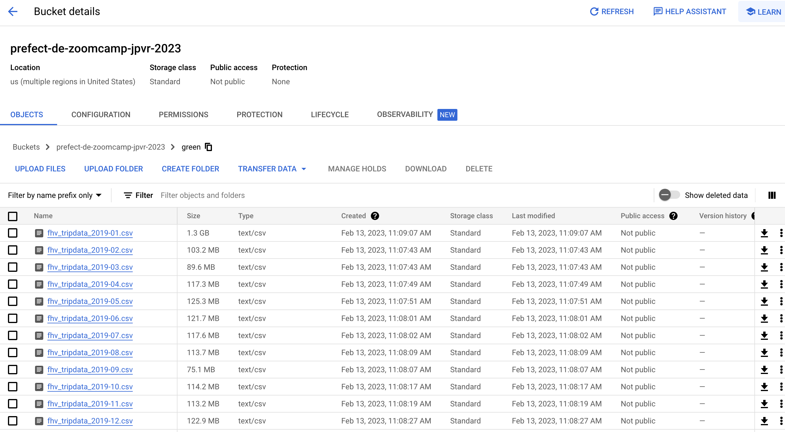
</p>

Create the external table
```sql
-- Creating external table referring to gcs path
CREATE OR REPLACE EXTERNAL TABLE `double-backup-374911.dezoomcamp.external_green_tripdata`
OPTIONS (
  format = 'CSV',
  uris = ['gs://prefect-de-zoomcamp-jpvr-2023/green/fhv_tripdata_2019-*.csv']
);
```

---

## Question 1:
What is the count for fhv vehicle records for year 2019?
- [] 65,623,481
- [X] 43,244,696
- [] 22,978,333
- [] 13,942,414

> Answer

<p align="center">
  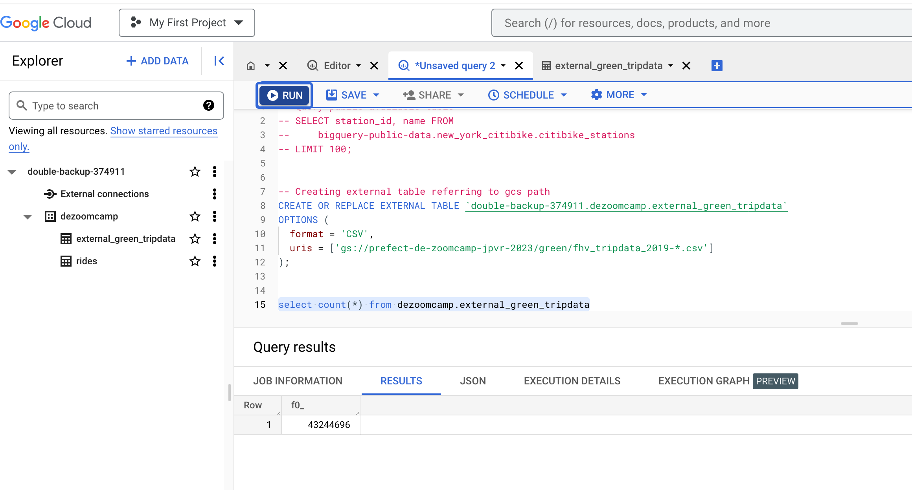
</p>

---

## Question 2:
Write a query to count the distinct number of affiliated_base_number for the entire dataset on both the tables.</br> 
What is the estimated amount of data that will be read when this query is executed on the External Table and the Table?

- [] 25.2 MB for the External Table and 100.87MB for the BQ Table
- [] 225.82 MB for the External Table and 47.60MB for the BQ Table
- [] 0 MB for the External Table and 0MB for the BQ Table
- [X] 0 MB for the External Table and 317.94MB for the BQ Table 

> Query external table
```sql
select count(DISTINCT(e.Affiliated_base_number))
from dezoomcamp.external_green_tripdata e;
```

```log
This query will process 0 B when run.
```

<p align="center">
  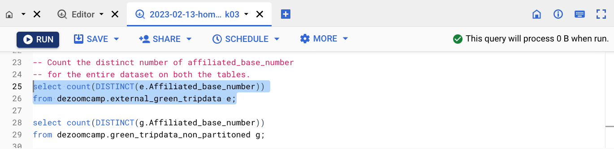
</p>


>  Query BQ table

```sql
select count(DISTINCT(g.Affiliated_base_number))
from dezoomcamp.green_tripdata_non_partitoned g;
```

```log
This script will process 317.94 MB when run.
```

<p align="center">
  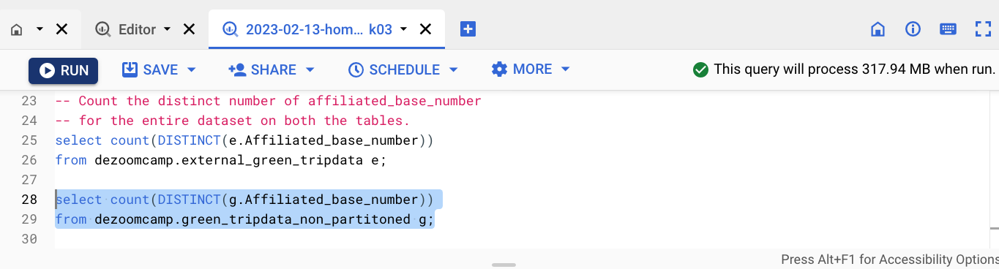
</p>

---

## Question 3:
How many records have both a blank (null) PUlocationID and DOlocationID in the entire dataset?
- [X] 717,748
- [] 1,215,687
- [] 5
- [] 20,332

> Answer

```sql
select count(*)
from dezoomcamp.green_tripdata_non_partitoned g
where g.PUlocationID is null
and   g.DOlocationID is null;
```

```log
717748
```

<p align="center">
  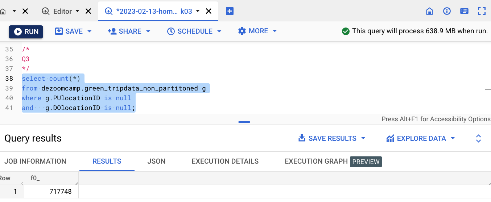
</p>

or
```sql
SELECT SUM(CASE WHEN ((g.PUlocationID IS NULL) AND (g.DOlocationID IS NULL)) THEN 1 ELSE 0 END) AS null_count
FROM dezoomcamp.green_tripdata_non_partitoned g;
```

<p align="center">
  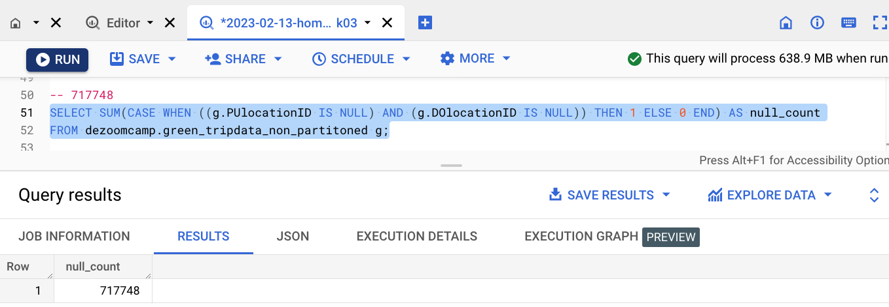
</p>

---

## Question 4:
What is the best strategy to optimize the table if query always filter by pickup_datetime and order by affiliated_base_number?
- [] Cluster on pickup_datetime Cluster on affiliated_base_number
- [X] Partition by pickup_datetime Cluster on affiliated_base_number
- [] Partition by pickup_datetime Partition by affiliated_base_number
- [] Partition by affiliated_base_number Cluster on pickup_datetime

> Answer

a) Cluster on pickup_datetime Cluster on affiliated_base_number
```sql
CREATE OR REPLACE TABLE dezoomcamp.green_tripdata_q4_a
CLUSTER BY pickup_datetime, affiliated_base_number
AS
SELECT * FROM dezoomcamp.external_green_tripdata;
```

b) Partition by pickup_datetime Cluster on affiliated_base_number
```sql
CREATE OR REPLACE TABLE dezoomcamp.green_tripdata_q4_b
PARTITION BY DATE(pickup_datetime)
CLUSTER BY affiliated_base_number
AS
SELECT * FROM dezoomcamp.external_green_tripdata;
```

c) Partition by pickup_datetime Partition by affiliated_base_number

According to [BigQuery's limitations](https://cloud.google.com/bigquery/docs/partitioned-tables#limitations), "_BigQuery does not support partitioning by multiple columns. Only one column can be used to partition a table._".

If you run the following SQL, it will raise the error "```Only a single PARTITION BY expression is supported but found 2```"

```sql
CREATE OR REPLACE TABLE dezoomcamp.green_tripdata_q4_c
PARTITION BY DATE(pickup_datetime), affiliated_base_number
AS
SELECT * FROM dezoomcamp.external_green_tripdata;
```

d) Partition by affiliated_base_number Cluster on pickup_datetime

According to [BigQuery's limitations](https://cloud.google.com/bigquery/docs/partitioned-tables#limitations), BigQuery only supports partitioning by either a "time-unit" or "integer-range" column.

If you run the following SQL, it will raise an error beginning with "```PARTITION BY expression must be DATE```"

```sql
CREATE OR REPLACE TABLE dezoomcamp.green_tripdata_q4_d
PARTITION BY affiliated_base_number
CLUSTER BY DATE(pickup_datetime)
AS
SELECT * FROM dezoomcamp.external_green_tripdata;
```

Querying the created tables:

```sql
-- This query will process 647.87 MB when run.
SELECT distinct(Affiliated_base_number)
FROM dezoomcamp.green_tripdata_q4_a -- Clustered on pickup_datetime Cluster on affiliated_base_number
WHERE DATE(pickup_datetime) BETWEEN '2019-02-01' AND '2019-02-28'
order by Affiliated_base_number desc;
```

<p align="center">
  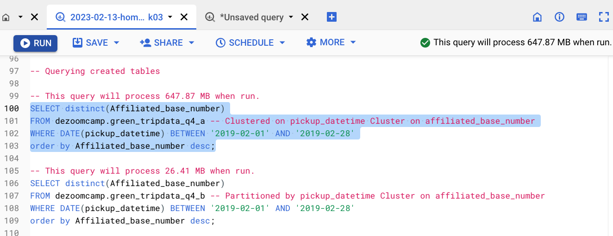
</p>

```sql
-- This query will process 26.41 MB when run.
SELECT distinct(Affiliated_base_number)
FROM dezoomcamp.green_tripdata_q4_b -- Partitioned by pickup_datetime Cluster on affiliated_base_number
WHERE DATE(pickup_datetime) BETWEEN '2019-02-01' AND '2019-02-28'
order by Affiliated_base_number desc;
```

<p align="center">
  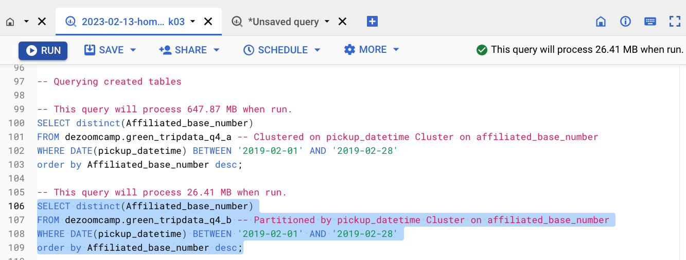
</p>

> So the best strategy, to optimize the table if query always filter by pickup_datetime and order by affiliated_base_number, is to partition by pickup_datetime and cluster on affiliated_base_number.

---

## Question 5:
Implement the optimized solution you chose for question 4. Write a query to retrieve the distinct affiliated_base_number between pickup_datetime 2019/03/01 and 2019/03/31 (inclusive).</br> 
Use the BQ table you created earlier in your from clause and note the estimated bytes. Now change the table in the from clause to the partitioned table you created for question 4 and note the estimated bytes processed. What are these values? Choose the answer which most closely matches.
- [] 12.82 MB for non-partitioned table and 647.87 MB for the partitioned table
- [X] 647.87 MB for non-partitioned table and 23.06 MB for the partitioned table
- [] 582.63 MB for non-partitioned table and 0 MB for the partitioned table
- [] 646.25 MB for non-partitioned table and 646.25 MB for the partitioned table

> Answer

Create the paritioned table

```sql
-- Creating a partition and cluster table
CREATE OR REPLACE TABLE dezoomcamp.green_tripdata_partitoned_clustered
PARTITION BY DATE(pickup_datetime)
CLUSTER BY affiliated_base_number
AS
SELECT * FROM dezoomcamp.external_green_tripdata;
```

<p align="center">
  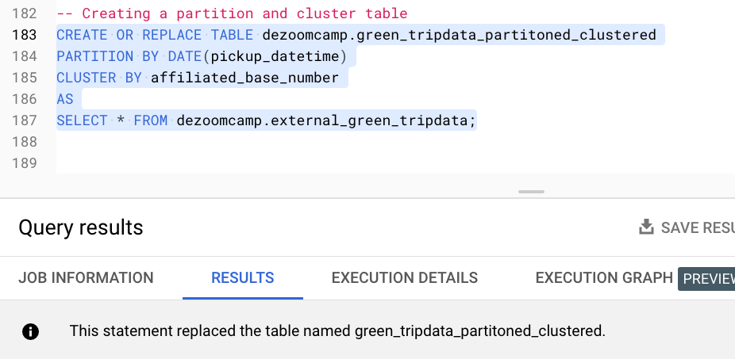
</p>

Estimate bytes

```sql
-- This query will process 647.87 MB when run.
SELECT distinct(Affiliated_base_number)
FROM dezoomcamp.green_tripdata_non_partitoned
WHERE DATE(pickup_datetime) BETWEEN '2019-03-01' AND '2019-03-31'
order by Affiliated_base_number;
```

<p align="center">
  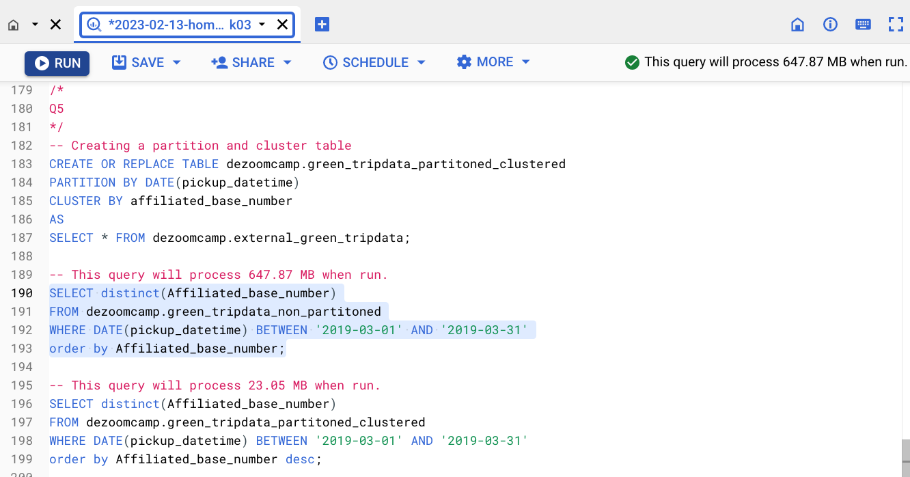
</p>

```sql
-- This query will process 23.05 MB when run.
SELECT distinct(Affiliated_base_number)
FROM dezoomcamp.green_tripdata_partitoned_clustered
WHERE DATE(pickup_datetime) BETWEEN '2019-03-01' AND '2019-03-31'
order by Affiliated_base_number desc;
```

<p align="center">
  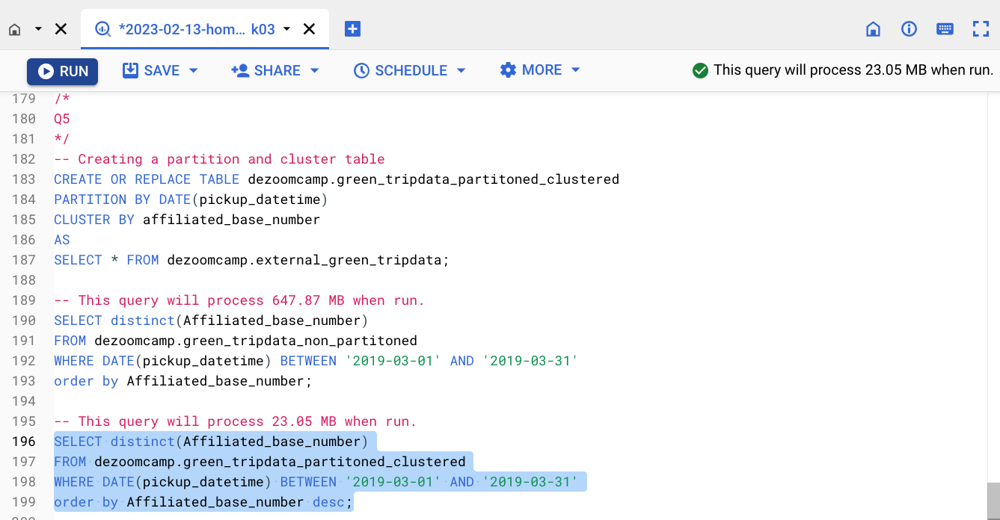
</p>


---

## Question 6: 
Where is the data stored in the External Table you created?

- [] Big Query
- [X] GCP Bucket
- [] Container Registry
- [] Big Table

> Answer

When you create an external table in BigQuery that references data stored in a GCS Bucket, the data remains in the GCS bucket and is not copied or stored in BigQuery. The external table acts as a virtual table that provides metadata about the data, such as the schema and data types, but the actual data remains in the GCS bucket.

When you query the external table in BigQuery, the query is executed against the data stored in the GCS bucket, and BigQuery retrieves only the necessary data to complete the query. This means that the data remains in the GCS bucket, and you can access it directly from the GCS bucket without having to query it through BigQuery.

External tables are useful for scenarios where you want to keep the data in its original storage location, but still make it accessible through BigQuery for querying and analysis. This can help to reduce storage costs and improve query performance, as you only need to store the data in a single location, and BigQuery can access it efficiently.

---

## Question 7:
It is best practice in Big Query to always cluster your data:
- [] True
- [X] False

> Answer

Clustering in BigQuery refers to organizing the data within a table based on the values in one or more columns, which can improve query performance. Whether or not it is a best practice to always cluster data in BigQuery depends on the specific use case and requirements of your data and queries.

Here are some factors to consider when deciding whether to cluster your data in BigQuery:
- Query patterns: If you frequently run queries that filter on the same columns, clustering the data based on those columns can help improve query performance.
- Data size: Clustering works best for large tables with billions of rows or more. For smaller tables, the performance improvement from clustering may be negligible.
- Data distribution: Clustering is most effective when the data is distributed evenly across the values in the clustering columns. If the data is heavily skewed towards a few values, clustering may not provide a significant performance improvement.
- Cost: Clustering in BigQuery can increase the storage cost for your data, as the clustering information is stored alongside the data.

In general, if you have a large table with complex queries that filter on a few columns, and the data is evenly distributed across those columns, clustering the data can be a good idea. However, you should carefully evaluate the trade-off between the performance benefits of clustering and the added storage costs.

---

## (Not required) Question 8:
A better format to store these files may be parquet. Create a data pipeline to download the gzip files and convert them into parquet. Upload the files to your GCP Bucket and create an External and BQ Table. 


Note: Column types for all files used in an External Table must have the same datatype. While an External Table may be created and shown in the side panel in Big Query, this will need to be validated by running a count query on the External Table to check if any errors occur. 
