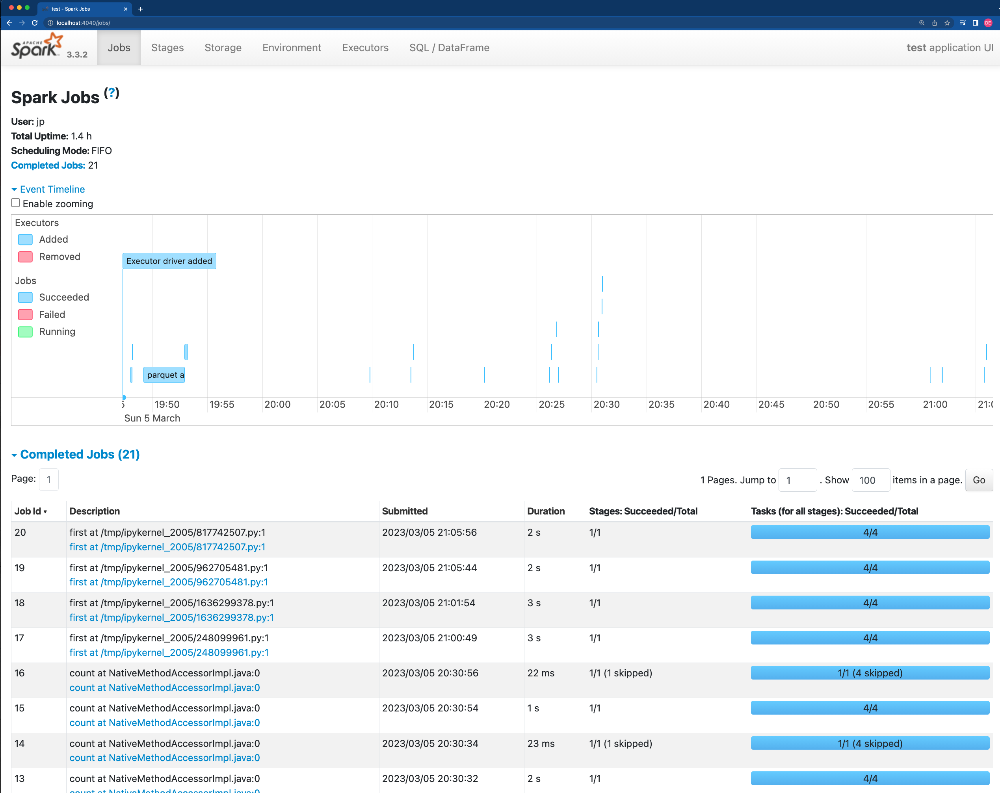

## Week 5 Homework 

In this homework we'll put what we learned about Spark in practice.

For this homework we will be using the FHVHV 2021-06 data found here. [FHVHV Data](https://github.com/DataTalksClub/nyc-tlc-data/releases/download/fhvhv/fhvhv_tripdata_2021-06.csv.gz )

### Setup

Jupyter Notebook code available in the [code/](./code/) folder.

---

### Question 1: 

**Install Spark and PySpark** 

- Install Spark
- Run PySpark
- Create a local spark session
- Execute spark.version.

What's the output?
- [X] 3.3.2
- [] 2.1.4
- [] 1.2.3
- [] 5.4
</br></br>

> Answer

```python
pyspark.__version__
```

```bash
'3.3.2'
```

---

### Question 2: 

**HVFHW June 2021**

Read it with Spark using the same schema as we did in the lessons.</br> 
We will use this dataset for all the remaining questions.</br>
Repartition it to 12 partitions and save it to parquet.</br>
What is the average size of the Parquet (ending with .parquet extension) Files that were created (in MB)? Select the answer which most closely matches.</br>


- [] 2MB
- [X] 24MB
- [] 100MB
- [] 250MB
</br></br>

> Answer

```python
!wget https://github.com/DataTalksClub/nyc-tlc-data/releases/download/fhvhv/fhvhv_tripdata_2021-06.csv.gz

schema_fhvhv_2021_06 = StructType([
    StructField("dispatching_base_num", StringType(), True),
    StructField("pickup_datetime", TimestampType(), True),
    StructField("dropoff_datetime", TimestampType(), True),
    StructField("PULocationID", IntegerType(), True),
    StructField("DOLocationID", IntegerType(), True),
    StructField("SR_Flag", IntegerType(), True),
    StructField("Affiliated_base_number", IntegerType(), True),])

 df = spark.read \
    .option("header", "true") \
    .schema(schema_fhvhv_2021_06) \
    .csv('fhvhv_tripdata_2021-06.csv.gz')

df = df.repartition(12)

df.write.parquet('fhvhv/2021/06/')

!ls -lh fhvhv/2021/06/ | awk '{print $5, $9}' | grep -v SUCCESS
```

```bash
23M part-00000-5db8d822-80b8-47f0-abb1-a2f9a4fe2263-c000.snappy.parquet
23M part-00001-5db8d822-80b8-47f0-abb1-a2f9a4fe2263-c000.snappy.parquet
23M part-00002-5db8d822-80b8-47f0-abb1-a2f9a4fe2263-c000.snappy.parquet
23M part-00003-5db8d822-80b8-47f0-abb1-a2f9a4fe2263-c000.snappy.parquet
23M part-00004-5db8d822-80b8-47f0-abb1-a2f9a4fe2263-c000.snappy.parquet
23M part-00005-5db8d822-80b8-47f0-abb1-a2f9a4fe2263-c000.snappy.parquet
23M part-00006-5db8d822-80b8-47f0-abb1-a2f9a4fe2263-c000.snappy.parquet
23M part-00007-5db8d822-80b8-47f0-abb1-a2f9a4fe2263-c000.snappy.parquet
23M part-00008-5db8d822-80b8-47f0-abb1-a2f9a4fe2263-c000.snappy.parquet
23M part-00009-5db8d822-80b8-47f0-abb1-a2f9a4fe2263-c000.snappy.parquet
23M part-00010-5db8d822-80b8-47f0-abb1-a2f9a4fe2263-c000.snappy.parquet
23M part-00011-5db8d822-80b8-47f0-abb1-a2f9a4fe2263-c000.snappy.parquet
```

---

### Question 3: 

**Count records**  

How many taxi trips were there on June 15?</br></br>
Consider only trips that started on June 15.</br>

- [] 308,164
- [] 12,856
- [X] 452,470
- [] 50,982
</br></br>

> Answer

```python
df_parquet = spark.read.parquet('fhvhv/2021/06/')

df_parquet \
    .withColumn('pickup_date', F.to_date(df_parquet.pickup_datetime)) \
    .select('pickup_date') \
    .filter(F.col('pickup_date') == '2021-06-15') \
    .count()
```

```bash
452470
```

---

### Question 4: 

**Longest trip for each day**  

Now calculate the duration for each trip.</br>
How long was the longest trip in Hours?</br>

- [X] 66.87 Hours
- [] 243.44 Hours
- [] 7.68 Hours
- [] 3.32 Hours
</br></br>

> Answer

```python
biggest_trip_in_seconds = df_parquet \
    .withColumn('trip_duration_in_seconds', \
        F.unix_timestamp(df_parquet.dropoff_datetime) - F.unix_timestamp(df_parquet.pickup_datetime)) \
    .select('trip_duration_in_seconds') \
    .orderBy(F.desc('trip_duration_in_seconds')).first()

biggest_trip_in_hours = int(biggest_trip_in_seconds['trip_duration_in_seconds'])/60/60

print(biggest_trip_in_hours)
```

```bash
66.87888888888888
```

---

### Question 5: 

**User Interface**

 Spark’s User Interface which shows application's dashboard runs on which local port?</br>

- [] 80
- [] 443
- [X] 4040
- [] 8080
</br></br>

> Answer

```bash
sudo lsof -p $(ps -fea | grep java | grep spark |  awk '{print $2}') | grep LISTEN | grep "*"
```

```
java    2057   jp  289u     IPv6              32057       0t0     TCP *:4040 (LISTEN)
```

<p align="center">
  
</p>

---

### Question 6: 

**Most frequent pickup location zone**

Load the zone lookup data into a temp view in Spark</br>
[Zone Data](https://github.com/DataTalksClub/nyc-tlc-data/releases/download/misc/taxi_zone_lookup.csv)</br>

Using the zone lookup data and the fhvhv June 2021 data, what is the name of the most frequent pickup location zone?</br>

- [] East Chelsea
- [] Astoria
- [] Union Sq
- [X] Crown Heights North
</br></br>

> Answer

```python
!wget https://github.com/DataTalksClub/nyc-tlc-data/releases/download/misc/taxi_zone_lookup.csv
```

```bash
...

Connecting to objects.githubusercontent.com (objects.githubusercontent.com)|185.199.110.133|:443... connected.
HTTP request sent, awaiting response... 200 OK
Length: 12322 (12K) [application/octet-stream]
Saving to: ‘taxi_zone_lookup.csv’

taxi_zone_lookup.cs 100%[===================>]  12.03K  --.-KB/s    in 0s      

2023-03-05 22:15:14 (55.7 MB/s) - ‘taxi_zone_lookup.csv’ saved [12322/12322]
```

```python
schema_taxi_zone_lookup = StructType([
    StructField("LocationID", IntegerType(), True),
    StructField("Borough", StringType(), True),
    StructField("Zone", StringType(), True),
    StructField("service_zone", StringType(), True)])

df_taxi_zl = spark.read \
  .option("header", "true") \
  .schema(schema_taxi_zone_lookup) \
  .csv('taxi_zone_lookup.csv')

df_parquet.createOrReplaceTempView('temp_table_fhvhv_tripdata')

df_taxi_zl.registerTempTable('temp_table_taxi_zone_lookup')

spark.sql("""
select t.PULocationID, z.Zone, count(*) as count
from temp_table_fhvhv_tripdata t, temp_table_taxi_zone_lookup z
where t.PULocationID = z.LocationID
group by t.PULocationID, z.Zone
order by count desc
limit 1
""").collect()[0]["Zone"]
```

```python
'Crown Heights North'
```

---

## Submitting the solutions

* Form for submitting: https://forms.gle/EcSvDs6vp64gcGuD8
* You can submit your homework multiple times. In this case, only the last submission will be used. 

Deadline: 06 March (Monday), 22:00 CET


## Solution

We will publish the solution here